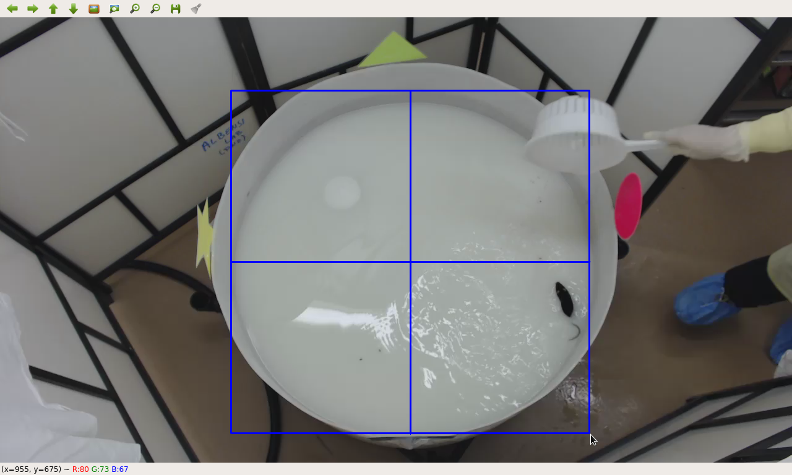
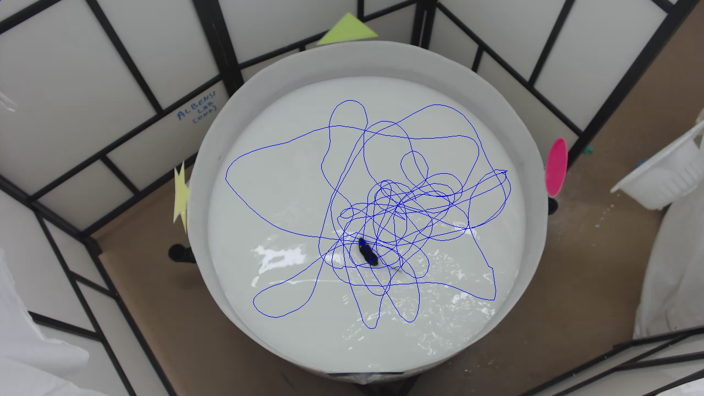
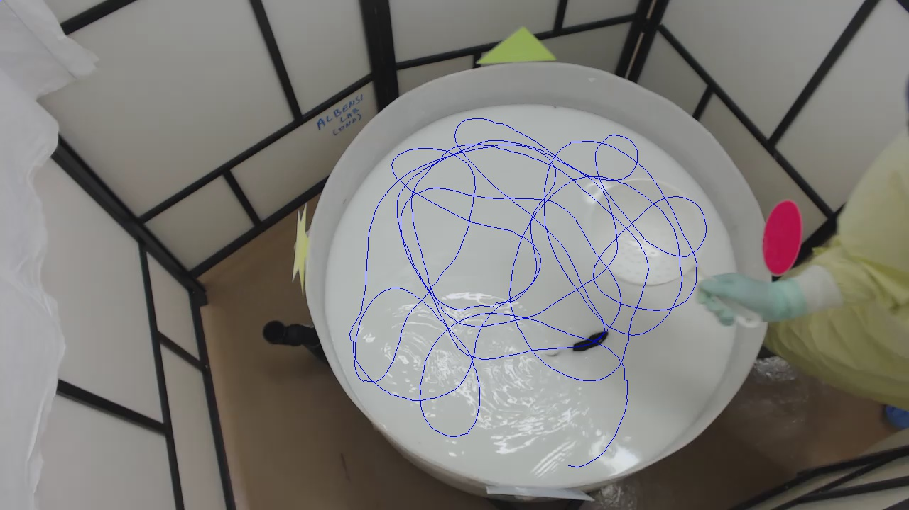

# Morris Water Maze (MWM) Tracker 
Author: Chris Cadonic  
License: GPL-3.0
---

A software framework that uses a particle filter to track the location of a mouse during Morris Water Maze (MWM) experiments. The intent is to build this framework as a very simple object-tracking software system for use in analyzing MWM experiments, but with the possibility of expanding this system to also incorporate tracking for other systems.

The default system implements Kernelized Correlation Filtering (KCF) to track the mouse. The intent is to expand and improve upon tracking for this particular application by also testing other filter trackers (Kalman and Particle) and CNN implementations such as YOLOv3.

## Prerequisites and Installation

This platform is built on Python 3.6, and thus requires only a working installation of Python 3.6 and the package manager *pip*. This tracking software uses the packages *pandas*, *tensorflow*, *opencv*, *numpy*, *scipy*, *xlrd*, *statsmodels*. To install specific versions, requirements are listed in the *requirements.txt* file. To install requirements using pip:

`pip install -r requirements.txt`

To install using anaconda:

`conda install --yes --file requirements.txt`

For most usage this will suffice. If a CNN approach is used, *tensorflow* will also be required, in which case the *requirements-tf.txt* file will install the appropriate requirements as above.

To run the program, assuming <MWMTracker> is the working directory, simply run the following in the command-line:

`python mwmtracker/main.py`

## Usage

Currently, the tracking software package is a command-line based interface with image popups using opencv for image display.

For all aspects and characteristics of the tracking software, the configuration file *config.yaml* contains parameters that can be altered for changing the operation of the tracking process. Of particular importance, are the following parameters:

| Parameter | Description |
| --- | :---: |
| `tracker` | Define which tracking algorithm will be used (e.g., *canny*, *template*, *cnn*, *pfilter*, *kalman*) |
| `datadir` | Define the directory containing experiment videos |
| `outputdir` | Define the output directory for tracking data and statistical analysis |
|  `templatedir` |  Define the directory used to store template images for template matching strategies (default is sufficient for most uses) |
|  `imagedir` | Define the output directory for trajectory tracings |
| `tracking_excel` | Define the output *xlsx* filename (including extension) |

There are various other parameters consequent to the operation of the tracker, such as training hyperparameters for CNN tracking, but these will be described in separate docs for each tracking implementation. The parameters listed above are primary global parameters universal for all approaches. These parameters, as well as parameters for each tracking implementation, will be absorbed into definition by users in a GUI in a future release rather than pre-defined in a crude configuration file.

Depending on the tracking method defined and the parameters for the selected tracker, the program will continue to load the specified data videos and prepare the system for tracking.

If parameters to bound the pool are selected, as is True by default (handled by the *boundPool* boolean parameter in *config.yaml*, then the user will be required to use the mouse to click and drag across the presented image to define the bounds of the water maze as follows:

Once the region of the pool has been selected, the tracker will then mask the pool region if selected for in the configuration file (boolean parameter *maskPool*, default True) and track the path of the mouse. 

Upon completion, the program will output images for each video using the first frame and a tracing of the path trajectory for that mouse, along with all of the data for all mice saved to the appropriate excel files once tracking is complete. Below are two sample output images.

## Testing

Unit and integration tests are currently under construction, as development of this program was primarily completed to acquire data for a recently completed Morris water maze experiment. Thus this program was not developed using a test-driven approach, but rather a waterfall approach that will continue to be expanded with more testing and refactoring to clean the approach outside of the already met deadline.

## Building and Deployment

As defined in the prerequisite and installation sections, this program requires only installation of Python 3.6 and the required packages defined in the requirements files.

## Contributing

As is standard for contributing to open-source projects on Github, you can easily contribute to this work by:

1. Forking the project,
2. implementing and commiting your changes to your local repo,
3. push your changes,
4. send a pull request
5. PROFIT?

## Change log

Major changes and releases for this work are as follows:

| Date | Version | Description |
| :---: | :---: | :---: |
| `November 12, 2018` | `v1.0.1` | Initial version -- Initial tracking system and statistical analysis in place |

## Authors and License

- **Chris Cadonic** - *initial author* - email: chriscadonic@gmail.com

## Acknowledgments

Thanks are in order to Dr. Benedict Albensi for funding the initial development of this program and for support. Also, thanks go out to Dr. Aida Adlimoghaddam and Claudia Cortes for their assistance in conducting the preliminary Morris water maze experiments that necessitated development of this program.
